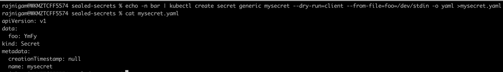
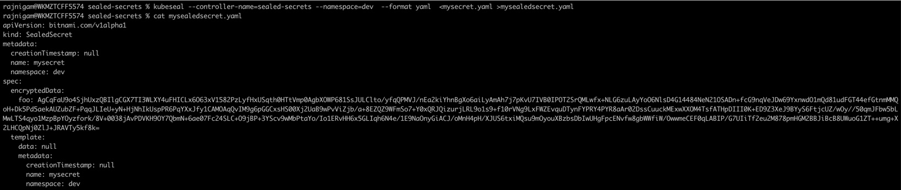
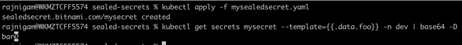

## Sealed Secrets | Store kubernetes secrets in Git

Lately I stumbled upon one of the project from **Bitnami-Labs** git repository. [Sealed-Secrets](https://github.com/bitnami-labs/sealed-secrets.git) is a pretty cool kubernetes controller
that gets deployed inside cluster. It provisions a pair of public/private key and expose http endpoint for public key distribution. It also creates a bunch of
CRDs to accept secrets in sealed format and later convert them into usual k8 secrets.

**kubeseal**, A Go binary that talks to http endpoint of controller to get public key and create a sealed secret. This secret can be easily stored in Git for auditing purpose.


### Usage
```
echo -n bar | kubectl create secret generic mysecret --dry-run=client --from-file=foo=/dev/stdin -o yaml >mysecret.yaml

```

```
If you installed the controller in a different namespace than the default kube-system, you need to provide this namespace to the kubeseal commandline tool. There are two options: You can specify the namespace via the command line option --controller-namespace <namespace> or via the environment variable SEALED_SECRETS_CONTROLLER_NAMESPACE.

kubeseal --controller-name=sealed-secrets --controller-namespace=default --format yaml  <mysecret.yaml >mysealedsecret.yaml
```

```
kubectl create -f mysealedsecret.json
```

### Verify Secrets
```
kubectl get secrets mysecret --template={{.data.foo}} | base64 -D
```

## Setup




## Install kubeseal
```
https://github.com/bitnami-labs/sealed-secrets/releases/tag/v0.18.1
```


